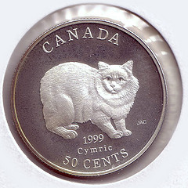

|      属性     |     含义      |      初始值     |    重要性      |
| ------------- |:-------------:| ------------- |:-------------:|
| id     |元素的id |  无     |必须 | 


##1.静态添加：
```javascript
    <div id="shelf" style="background-position:0 0;"> 
        <div id="container2"> 
             
             
             
             
             
             
             
             
             
             
        </div> 
   </div> 
   <script type="text/javascript">
        $(function(){
        	$('#container2').coverscroll();
	    });
	</script> 
```
##效果演示：


##2.动态添加
```javascript
<div id="shelf"> 
    <div id="container"> 
     <div class="item"> 
       
      <div class="similarity">05</div> 
      <div class="itemTitle">the title 1</div> 
     </div> 
    </div> 
   </div>
   <!--shelf end--> 
   <script type="text/javascript">
    $(function(){
		$('#container').coverscroll({
			items:'.item',
			minfactor:10,
			scalethreshold:5,
			staticbelowthreshold:true,
			distribution:1
		});
	});

	// 演示，动态地添加项目的CoverScroll
	var cnt = 0;
	var aitems = [
		'<div class="item"><div class="similarity">05</div><div class="itemTitle">the title 2</div></div>',
		'<div class="item"><div class="similarity">05</div><div class="itemTitle">the title 3</div></div>',
		'<div class="item"><div class="similarity">05</div><div class="itemTitle">the title 4</div></div>',
		'<div class="item"><div class="similarity">05</div><div class="itemTitle">the title 5</div></div>',
		'<div class="item"><div class="similarity">05</div><div class="itemTitle">the title 6</div></div>',
		'<div class="item"><div class="similarity">05</div><div class="itemTitle">the title 7</div></div>',
		'<div class="item"><div class="similarity">05</div><div class="itemTitle">the title 8</div></div>',
		'<div class="item"><div class="similarity">05</div><div class="itemTitle">the title 9</div></div>',
		'<div class="item"><div class="similarity">05</div><div class="itemTitle">the title 10</div></div>',
		'<div class="item"><div class="similarity">05</div><div class="itemTitle">the title 11</div></div>',
		'<div class="item"><div class="similarity">05</div><div class="itemTitle">the title 12</div></div>',
		'<div class="item"><div class="similarity">05</div><div class="itemTitle">the title 13</div></div>',
		'<div class="item"><div class="similarity">05</div><div class="itemTitle">the title 14</div></div>'
	];

	function addItem(){
		$('#container').append(aitems[cnt]);
		$('#container').coverscroll({
			items:'.item',
			minfactor:10,
			scalethreshold:5,
			staticbelowthreshold:true,
			distribution:1,
			bendamount:1.5,
			movecallback:getStatus
		});
		cnt++;
		if(cnt >= aitems.length){
			cnt=0
		}
	}
	function getStatus(){
		var stats = ($('#container .selectedItem').index()+1)+' of '+$('#container .item').length;
		$('#stats').html(stats);
	}
	</script> 
```
##效果演示：

